# sisfokol_yayasan

SISFOKOL YAYASAN v1.0 , khusus untuk kalangan internal yayasan, agar bisa memantau sekolah - sekolah yang dimiliki.

Dibuat dan dites dengan WebServer XAMPP PHP 7.4 . Pada LinuxMint.

---

FITUR :

- Multiple Sekolah

- Kepegawaian Sekolah

- Keuangan Sekolah

- Sarpras Sekolah

- Forum

- FileBox Dokumen

- Inbox Pesan 

---

TAMPILAN / SKRINSUT :  

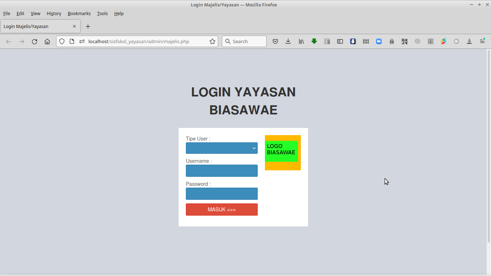 

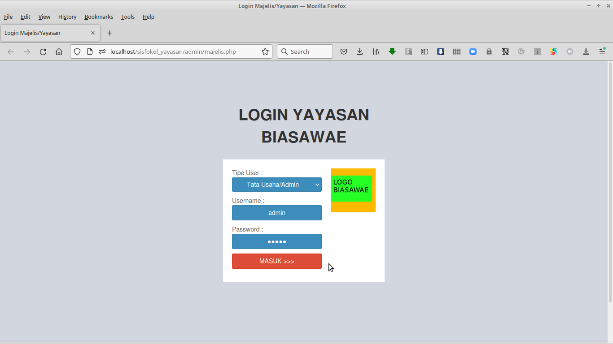 

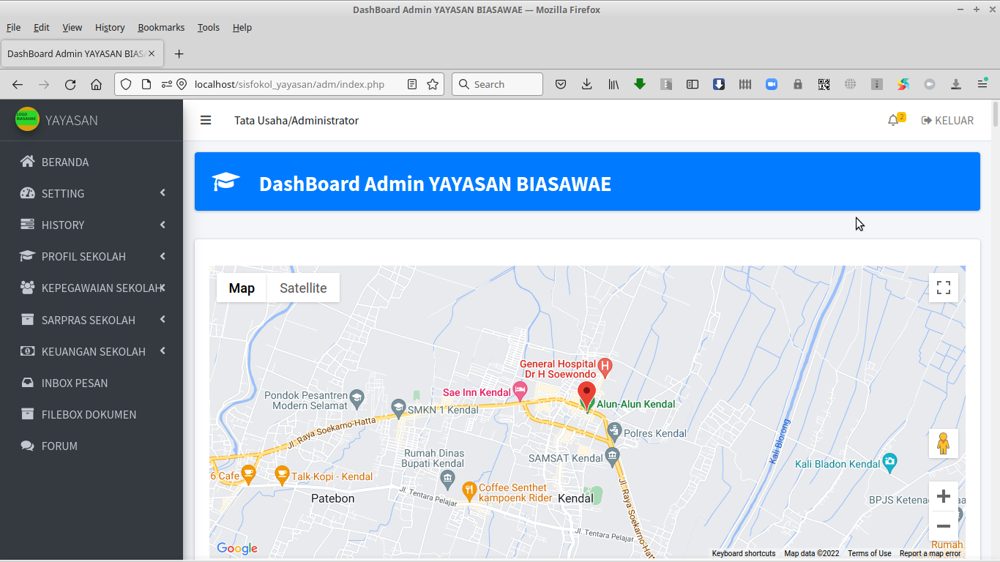 

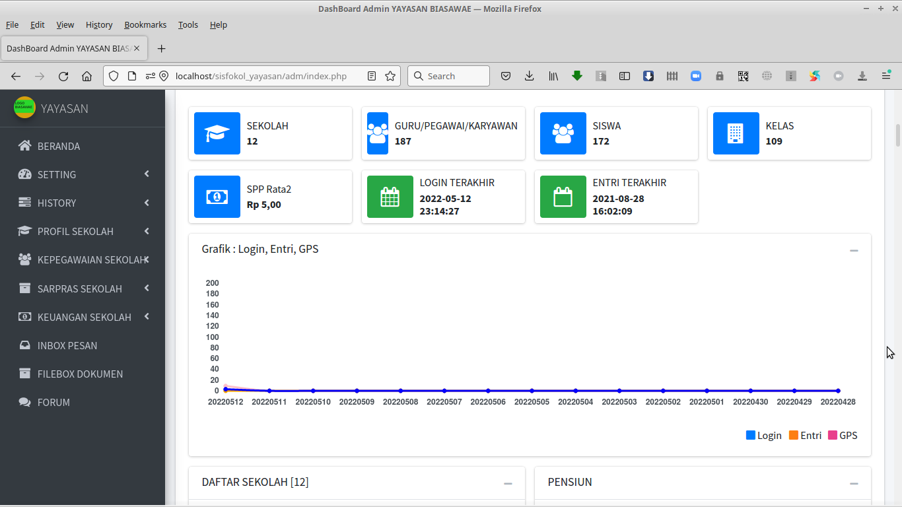 

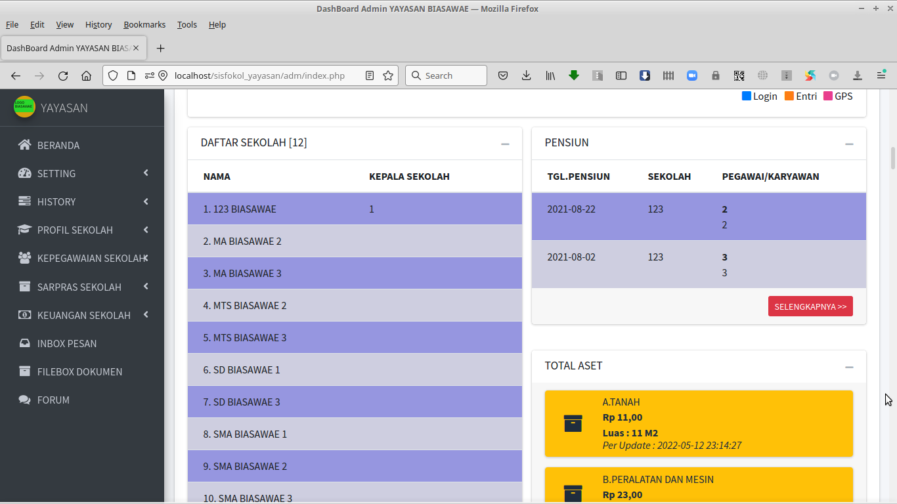 

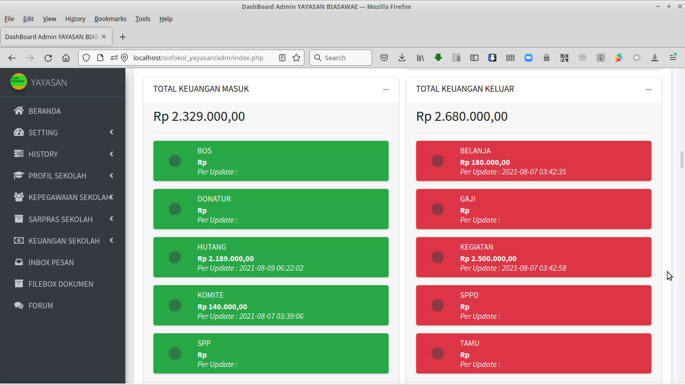 

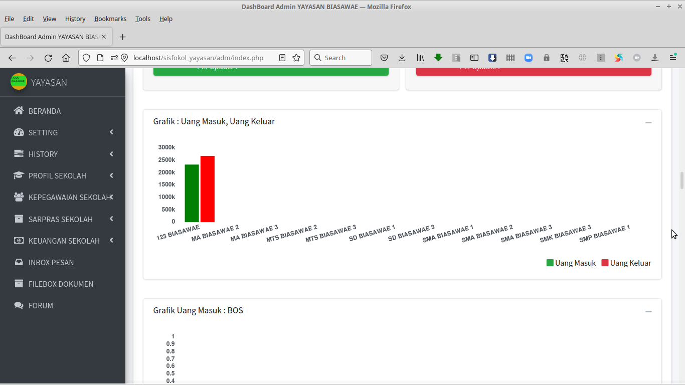 

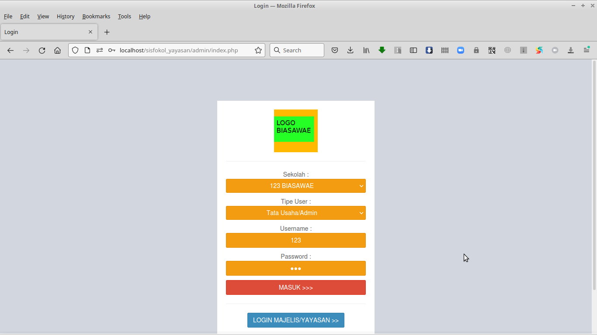 

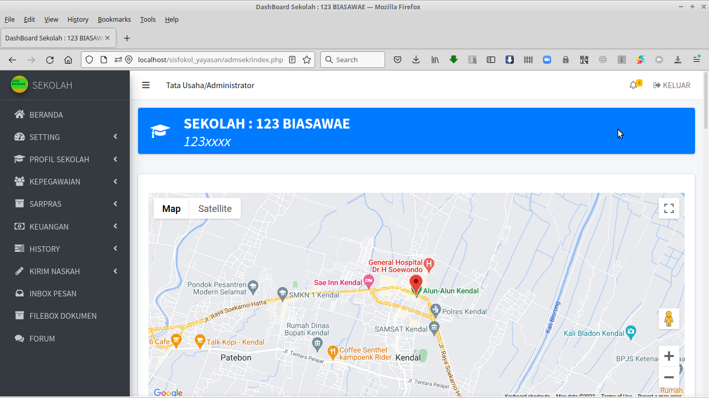 

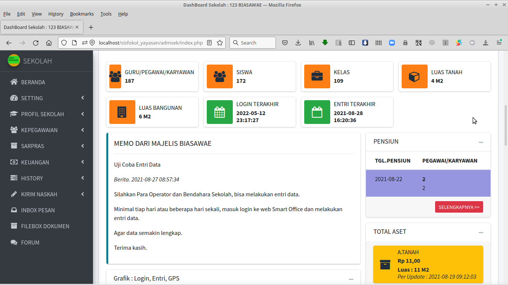 

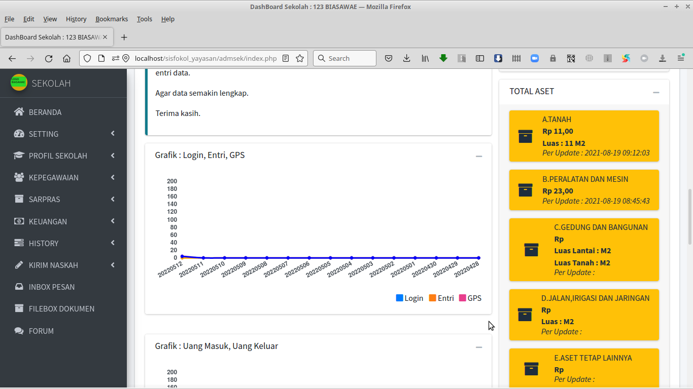 

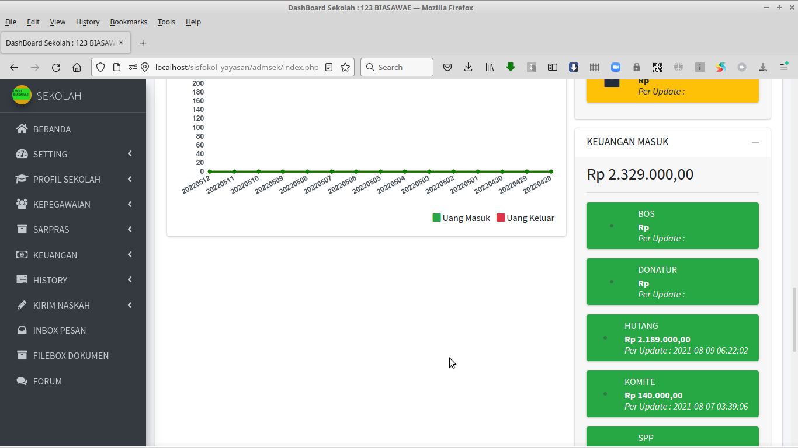 

---

INSTALASI DAN KONFIGURASI :  

1. Ekstrak file web ke folder web webserver www atau htdocs

2. Untuk konfigurasi, bisa set di file /inc/config.php

3. Jalankan phpmyadmin, buatlah sebuah database. dan lakukan import file database .sql, ada di folder /db

4. Jalankan SISFOKOL-YAYASAN sesuai alamat web yang ada.

---

AKSES USER MAJELIS/YAYASAN :

---

http://alamat_webnya/admin/majelis.php

Tipe User Tata Usaha/admin :

User/pass : admin

Tipe User Pegawai/Karyawan :

User/pass : 1

AKSES USER SEKOLAH :

---

http://alamat_webnya/admin

Sekolah : 123 BIASAWAE

Tipe User : Tata Usaha/admin 

User/pass : 123

Tipe User : Pegawai/Karyawan 

User/pass : 1

Tipe User : Kepegawaian 

User/pass : 1

Tipe User : SARPRAS 

User/pass : 1

Tipe User : Keuangan 

User/pass : 1

---

NB. 

DEMO ONLINE atau ingin request custom konten berbayar, silahkan bisa hubungi : 

hp/sms/wa : 081-829-88-54 

atau email : hajirodeon@gmail.com

